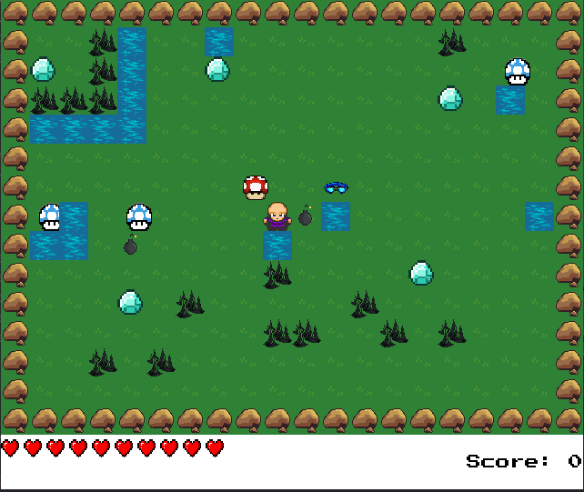

# Diamond Collector - A 2D Top-Down Adventure Game


Welcome to Diamond Collector, an engaging 2D top-down view game where you embark on an exciting adventure to collect diamonds, showcase your agility, and achieve the highest score possible! Dodge obstacles, strategically navigate the terrain, and make every step count to emerge as the ultimate Diamond Collector.

## Features

- **Explore the World:** Roam freely within a small 16 tile (32px x 32px) wide and tall box :)
- **Collect Diamonds:** Your main objective is to collect diamonds scattered randomly across the map. Gather five diamonds to complete the game.
- **Scoring System:** Your score is calculated based on two factors: the number of steps taken (less is better) and your health points (more is better) when collecting a diamond.
- **Health Points (HP):** Be cautious! Your health points decrease when collecting a diamond. Manage your health wisely to maximize your overall score.
- **Game Over Screen:** The game ends when you successfully collect five diamonds. Your final score will be displayed.

## Controls

- **Arrow Keys:** Move your character in the desired direction.
- **T:** Activate / deactivate waterproof "suit" if collected.
- **B:** Throw bombs to destroy spikes around your character.

## How to Play

1. **Start the Game:** Run the game and embark on your Diamond Collector journey.
2. **Navigate:** Use the arrow keys to navigate the game world, avoiding obstacles and seeking out diamonds.
3. **Collect Diamonds:** Approach diamonds to collect them. Keep an eye on your health points!
4. **Game Over:** The game concludes after collecting five diamonds. Your final score, steps taken, and health points will be revealed.
5. **Challenge Yourself:** Strive for the lowest step count and the highest health points to achieve the ultimate Diamond Collector status!

## Installation

1. Clone the repository:

    ```bash
    git clone https://github.com/Tomasdelpinorep/robot_pygame2.0.git
    ```

2. Run the game:

    ```bash
    python main.py
    ```

## Dependencies

- Python 3.x
- Pygame

## Credits

- Game developed by Tomás del Pino, inspired by [ShawCode](https://www.youtube.com/@ShawCode).


## Contributions

Contributions are welcome! Feel free to fork the repository and submit pull requests to enhance the game.

## License

This project is licensed under the [Apache 2.0 License](LICENSE.md).

Enjoy playing Diamond Collector! 🎮💎
